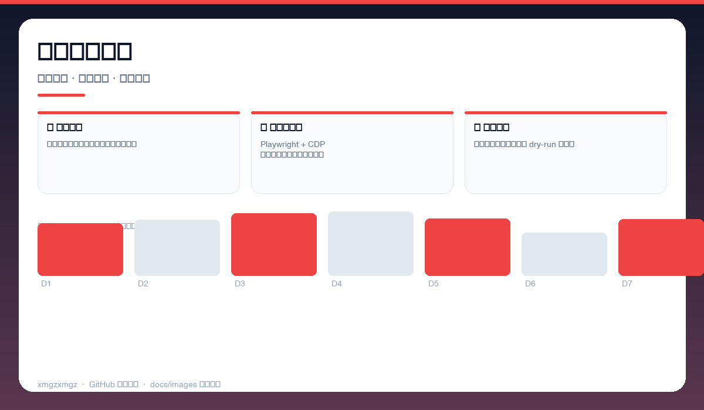
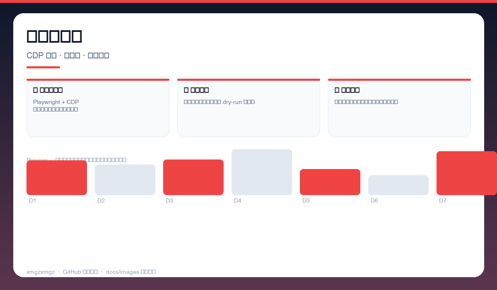
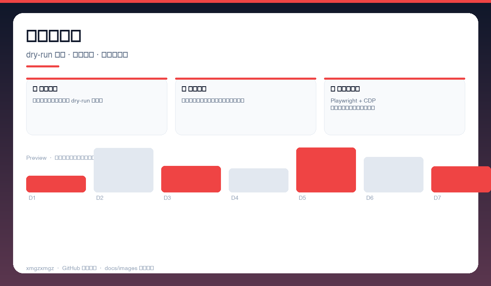

# 🗑️ google-photos-bulk-delete — google-photos-bulk-delete

> Google Photos 一键按天批量删除 — Playwright 驱动，真机 CDP 精准勾选。

[](https://github.com/xmgzxmgz/google-photos-bulk-delete)
[](https://github.com/xmgzxmgz/google-photos-bulk-delete/releases)
[](LICENSE)
[](https://github.com/xmgzxmgz/google-photos-bulk-delete/actions/workflows/release.yml)

---

## ✨ 功能一览

| 模块 | 能力 | 状态 |
|------|------|------|
| 📅 按天勾选 | 自动定位日期分组，一键全选一天照片 | ✅ |
| 🤖 真机自动化 | Playwright + CDP 复用已登录态，稳定不封号 | ✅ |
| 🧹 安全确认 | 删除前预览清单，支持 dry-run 与分批 | ✅ |

---

## 📸 功能预览

> 以下为自动生成的示意预览（无需本地部署截图），展示核心功能形态。

| 总览 | 细节 | 流程 |
|------|------|------|
|  |  |  |
| 按天批量选择 · 日期分组 · 一键全选 · 数量预览 | 自动化执行 · CDP 驱动 · 进度条 · 失败重试 | 安全与回滚 · dry-run 清单 · 分批删除 · 日志可审计 |

<details>
<summary>查看大图</summary>


</details>

---

## 🚀 快速开始

```bash
pip install -r requirements.txt
playwright install chromium
python bulk_delete.py --date 2024-05-20 --dry-run
python bulk_delete.py --date 2024-05-20 --confirm
```

---

## 🛠 技术栈

Python · Playwright · Chrome DevTools Protocol · Automation

---

## 🗂️ 目录结构（节选）

```
google-photos-bulk-delete/
├── docs/images/        # 本 README 的三张自动生成预览图
├── .github/workflows/  # Auto Release 自动发版
├── README.md
└── ...                 # 源码与配置
```

---

## 📦 Releases

本仓库已启用 **Auto Release**（`.github/workflows/release.yml`）：

- 推送 `v*` tag 自动发版：`git tag v0.2.0 && git push origin v0.2.0`
- 手动触发：`gh workflow run "Auto Release" -f version=v0.2.0`（留空则自动 patch +1）
- 变更说明自动生成（`--generate-notes`）

前往 [Releases](https://github.com/xmgzxmgz/google-photos-bulk-delete/releases) 查看。

---

## 🙏 相关项目

- [workbuddy-account-hub](https://github.com/xmgzxmgz/workbuddy-account-hub) — WorkBuddy 账户中枢（本 README 的样板）
- 更多见 [xmgzxmgz 主页](https://github.com/xmgzxmgz)

---

## 许可

MIT
